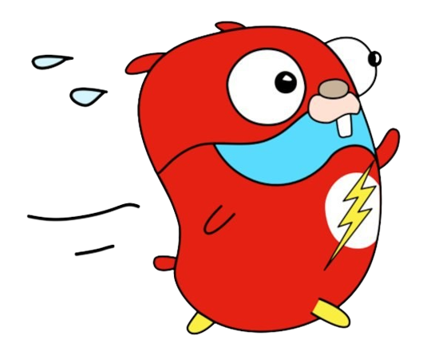
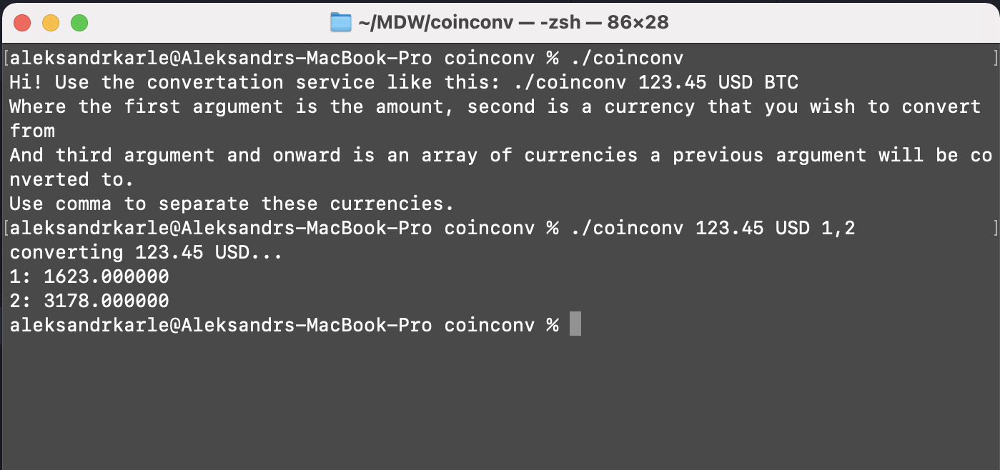

# Coin Converter

## Task description

Task description is in [DESCRIPTION.md](DESCRIPTION.md)

## Solution note
Since free plan has a restrictions to convert multiple currencies I've decided to perform multiple requests, so you're able to use comma-separate Codes or IDs from 3rd argument and onward :trophy:

## HOWTO

- build the app
```bash
make build
```
And you are ready to go! You can convert currencies like this
```bash
./coinconv 123.45 USD BTC,ETH
```
But it is suggested to use coins IDs instead of codes to avoid collisions
```bash
./coinconv 123.45 USD 1,2
```
Be aware that by default app using Sandbox API, you can add your API key in main file and set **IS_TEST** to false.

## A picture is worth a thousand words


